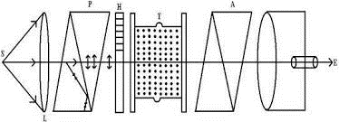
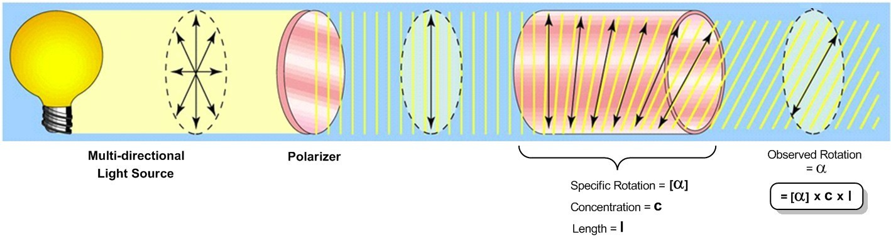
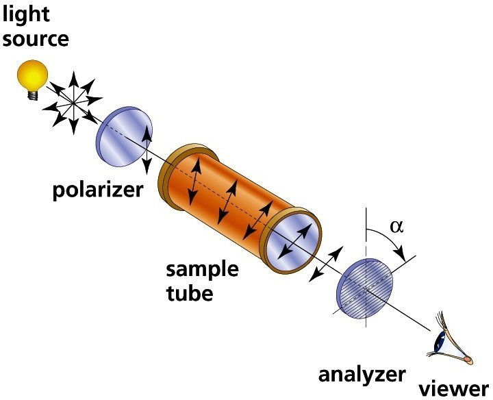

<h3>Procedure</h3>

<ol>
   <li>Fill the Polarimeter tube with water & put it in the Polarimeter</li>
   <li>The telescope is focused on the half shade & the analyzer is rotated till the equal intensity of light is obtained the reading for this position of telescope is noted.</li>
   <li>Now the tube filled with optically active liquid</li>
   <li>The analyzer is rotated till the equal intensity of light is obtained in the field of view of telescope. The new position of analyzer is noted in the observation table. The difference in the two readings gives the angle of rotation. Specific rotation of solution can be determine use in the above formula.</li>
</ol>

 
 

<h3>Diagram</h3>
 

<h3>Observation</h3>

<ol>
   <li><b>Least count of Polarimeter = ______</b></li>
   <li><b>For angle of rotation(θ)</b></li>
</ol>

<h3> Observation Table</h3>

<table style="border-collapse: collapse; width: 100%;">
        <thead>
            <tr>
                <th rowspan="2" style="border: 1px solid black; text-align: center; padding: 8px;">Sr. No.</th>
                <th colspan="5" style="border: 1px solid black; text-align: center; padding: 8px;">CSR with Distilled Water</th>
                <th colspan="5" style="border: 1px solid black; text-align: center; padding: 8px;">CSR with Sugar Solution</th>
                <th  style="border: 1px solid black; text-align: center; padding: 8px;">Angle of Rotation</th>
            </tr>
            <tr>
                <th colspan="1" style="border: 1px solid black; text-align: center; padding: 8px;">MSR</th>
                <th colspan="2" style="border: 1px solid black; text-align: center; padding: 8px;">VSR = (LC &times; coinciding line)</th>
                <th colspan="2" style="border: 1px solid black; text-align: center; padding: 8px;">TR = θ1</th>
                <th colspan="1" style="border: 1px solid black; text-align: center; padding: 8px;">MSR</th>
                <th colspan="2" style="border: 1px solid black; text-align: center; padding: 8px;">VSR = (LC &times; coinciding line)</th>
                <th colspan="2" style="border: 1px solid black; text-align: center; padding: 8px;">TR = θ2</th>
                <th colspan="2" style="border: 1px solid black; text-align: center; padding: 8px;">θ = θ1 - θ2</th>
            </tr>
        </thead>
        <tbody>
            <tr>
                <td style="border: 1px solid black; text-align: center; padding: 8px;">1</td>
                <td colspan="1" style="border: 1px solid black; text-align: center; padding: 8px;"></td>
                <td colspan="2" style="border: 1px solid black; text-align: center; padding: 8px;"></td>
                <td colspan="2" style="border: 1px solid black; text-align: center; padding: 8px;"></td>
                <td colspan="1" style="border: 1px solid black; text-align: center; padding: 8px;"></td>
                <td colspan="2" style="border: 1px solid black; text-align: center; padding: 8px;"></td>
                <td colspan="2" style="border: 1px solid black; text-align: center; padding: 8px;"></td>
                <td colspan="2" style="border: 1px solid black; text-align: center; padding: 8px;"></td>
            </tr>
            <tr>
                <td style="border: 1px solid black; text-align: center; padding: 8px;">2</td>
                <td colspan="1" style="border: 1px solid black; text-align: center; padding: 8px;"></td>
                <td colspan="2" style="border: 1px solid black; text-align: center; padding: 8px;"></td>
                <td colspan="2" style="border: 1px solid black; text-align: center; padding: 8px;"></td>
                <td colspan="1" style="border: 1px solid black; text-align: center; padding: 8px;"></td>
                <td colspan="2" style="border: 1px solid black; text-align: center; padding: 8px;"></td>
                <td colspan="2" style="border: 1px solid black; text-align: center; padding: 8px;"></td>
                <td colspan="2" style="border: 1px solid black; text-align: center; padding: 8px;"></td>
            </tr>
        </tbody>
    </table>

<h3>Result</h3>

   <b>Specific Rotation of Sugar solution is found out to be ______</b>

